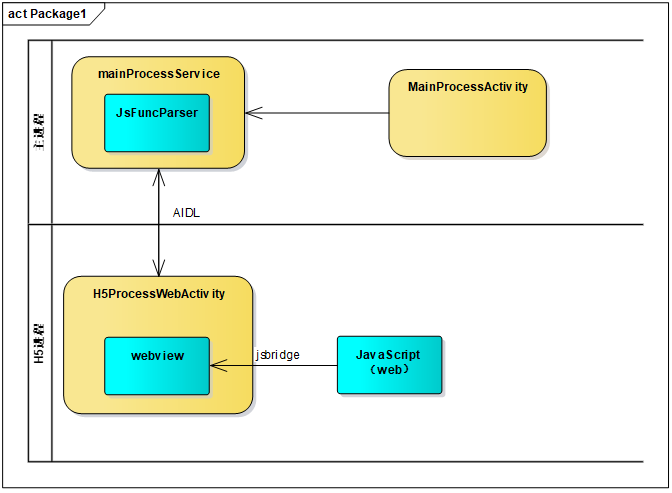

# lib_webview


该库是跨进程调用的webView库，其中包括了，webview和Js通信流程，以及AIDL跨进程通信机制。同时组件库内实现了对JS回调函数的解析。


## 目录结构 

`library_webview` 是跨进程web组件，封装了上述功能。

`app` 是demo程序展示了如何调用和跳转webview组件，以及注册跨进程处理方法。


## 原理图





## 使用方式

```java
Intent webIntent = new Intent(this, WebViewActivity.class);
webIntent.putExtra("url", "file:///android_asset/Webdemo/index.html");
startActivity(webIntent);

//注册回调处理方法
JavaScriptBridge.getInstance().registerJavaScriptBridge(WebRegister.class);

  //调用Js方法
JavaScriptBridge.getInstance().callJavaScript("jsonString");
```


